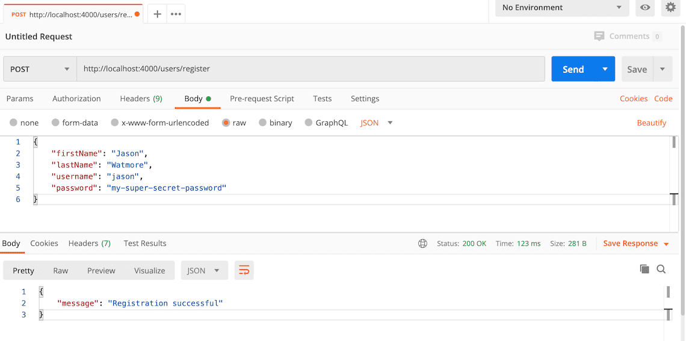

# Node mysql marcipriano

> Node.js + API MySQL para gerenciamento de usuários, autenticação e registro

## Exemplos

> <http://localhost:4000/users/register>

## Rotas

### Registrar

> <http://localhost:4000/users/register>

```json
{
    "firstName": "Jason",
    "lastName": "Watmore",
    "username": "jason",
    "password": "my-super-secret-password"
}
```


