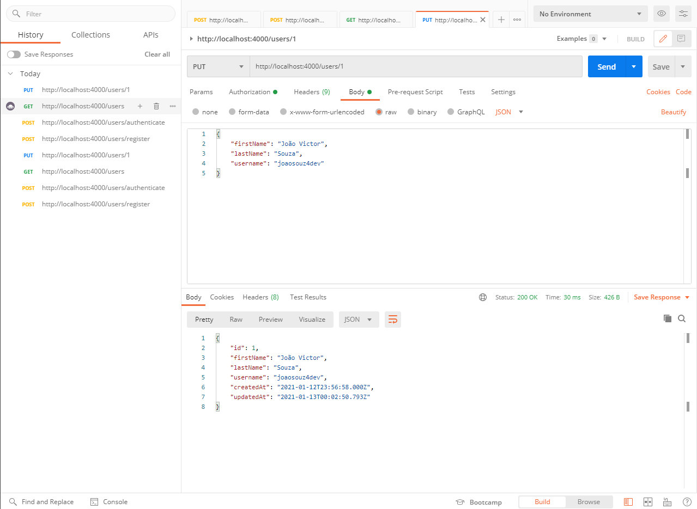

# Node mysql marcipriano

> Node.js + API MySQL para gerenciamento de usuários, autenticação e registro

## Exemplos

> <http://localhost:4000/users/register>

## Rotas

### Registrar POST

> <http://localhost:4000/users/register>

```json
{
    "firstName": "Jason",
    "lastName": "Watmore",
    "username": "jason",
    "password": "my-super-secret-password"
}
```


### Autenticar POST

> <http://localhost:4000/users/authenticate>

```json
{
    "username": "jason",
    "password": "my-super-secret-password"
}
```


### Retornar Usuários GET

> Nessa rota precisa passar o `token` requisitado.
> <http://localhost:4000/users>


### Atualizando um usuário PUT

> Para atualizar basta passar na url a id do usuário desejado e o token na autorização. ex: `/users/{id}`
> <http://localhost:4000/users/1>

```json
{
    "firstName": "Foo",
    "lastName": "Bar"
}
```


