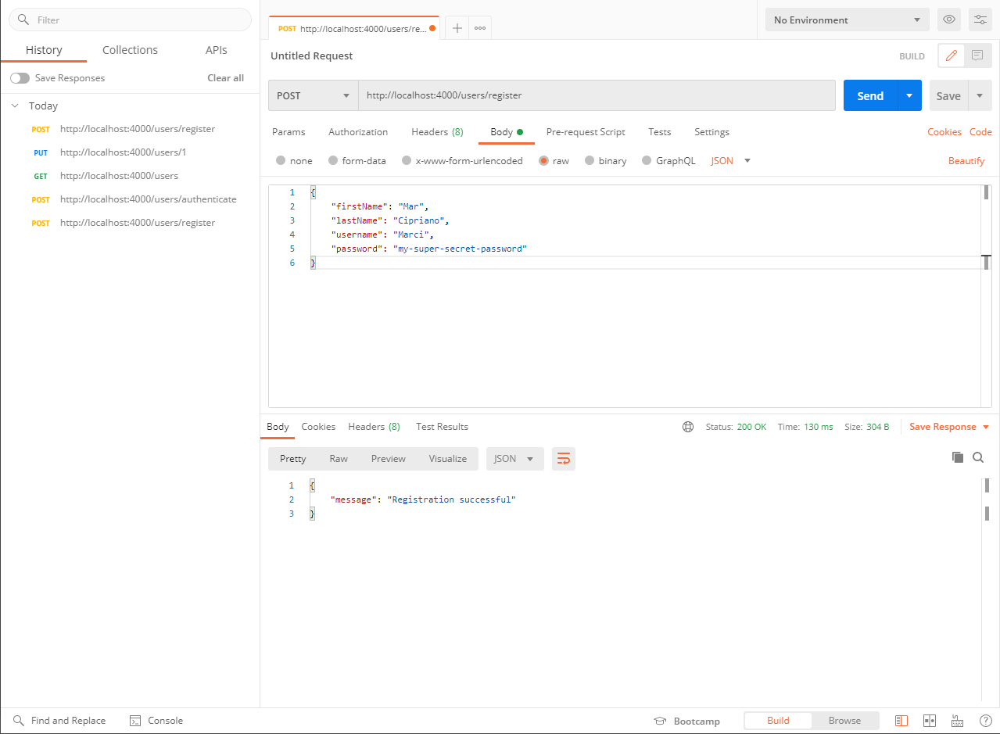
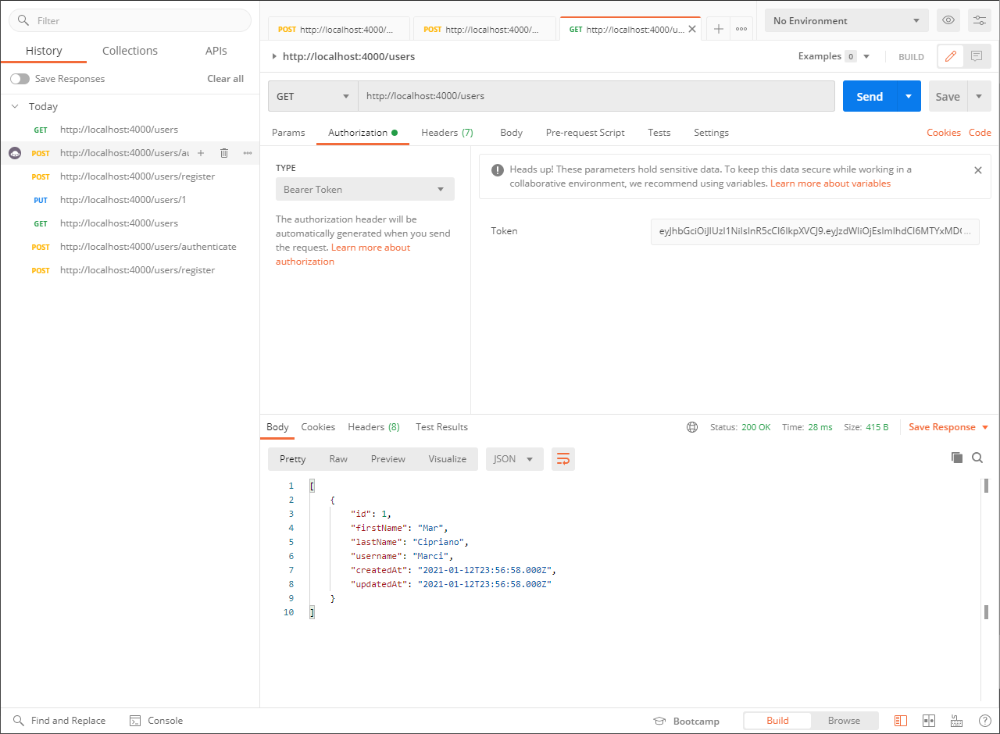
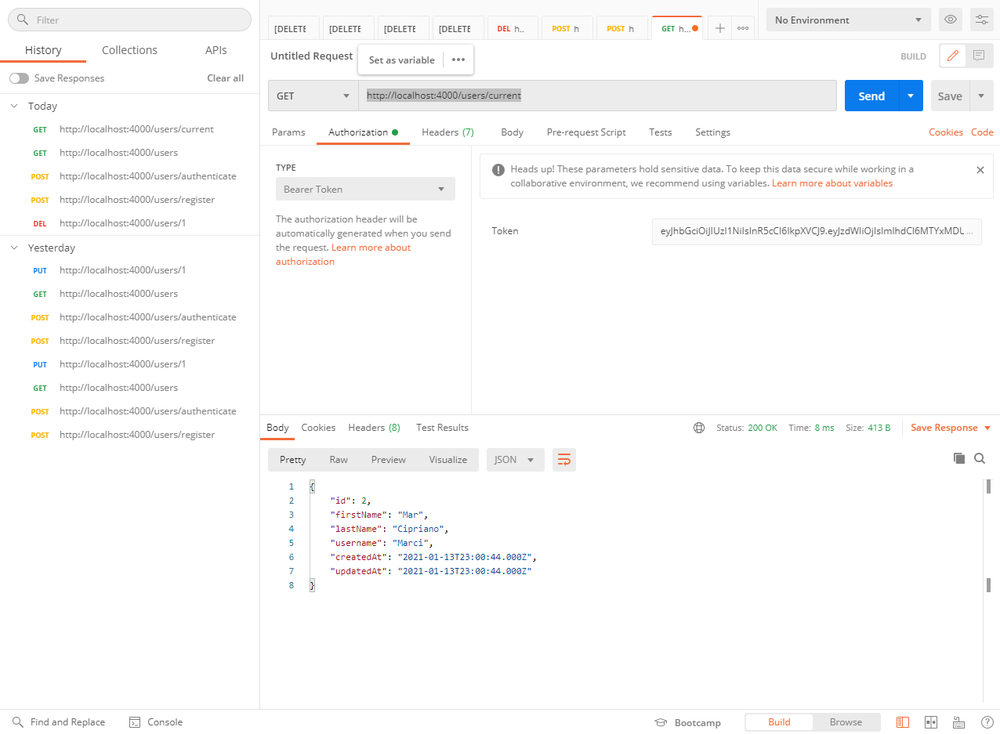

# Node mysql Auth

> Node.js + MySQL API for user management, authentication and registration

## MySQL database

> To modify the database connection data just access the `config.json` file.

## Routes

[](https://god.postman.co/run-collection/94a25c9bc7325f1c9dbf)

### Register POST

> <http://localhost:4000/users/register>

```json
{
    "firstName": "Mar",
    "lastName": "Cipriano",
    "username": "Marci",
    "password": "my-super-secret-password"
}
```



### Authenticate POST

> <http://localhost:4000/users/authenticate>

```json
{
    "username": "Marci",
    "password": "my-super-secret-password"
}
```


### Return GET Users

> In this route you need to pass the requested `token`.
> <http://localhost:4000/users>



### Updating a PUT User

> To update, just pass the desired user id and authorization token in the url. ex: `/users/{id}`
> <http://localhost:4000/users/1>

```json
{
    "firstName": "João Victor",
    "lastName": "Souza",
    "username": "joaosouz4dev"
}
```


### Deleting a DELETE user

> To delete, just pass the desired user id and authorization token in the url. ex: `/users/{id}`
> <http://localhost:4000/users/1>


### Capturing user based on GET token

> In this route you need to pass the requested `token`.
> <http://localhost:4000/users/current>


